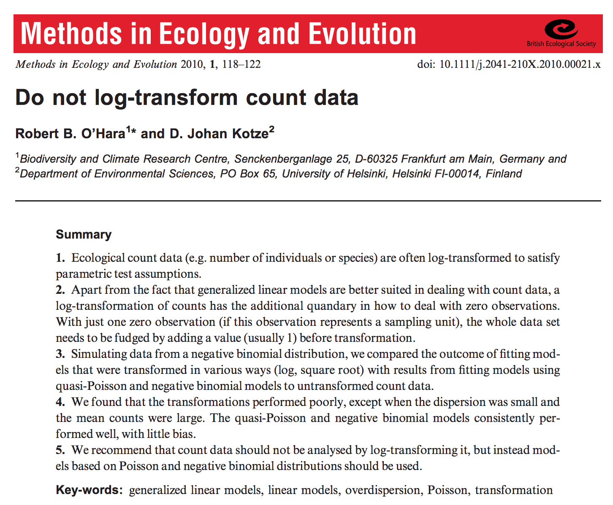
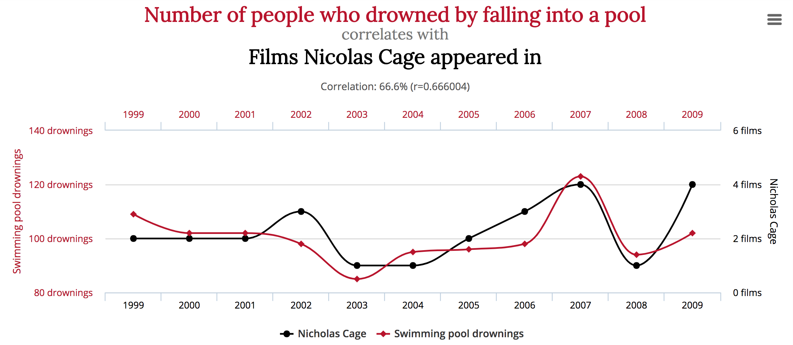

## linear models

The equation for a linear regression model with one covariate looks something like this:

$$
y_i = \text{intercept} + \text{slope} \times x_i + \epsilon_i
$$

where $\epsilon$ represents noise, or measurement error, and is assumed to be normally distributed:
$$
\epsilon_i \sim N(0, \sigma^2)
$$

## linear models

We also write this model:
$$
y_i = \text{intercept} + \text{slope} \times x_i + \epsilon_i
$$

$$
\epsilon_i \sim N(0, \sigma^2)
$$

like this:
$$
y_i \sim N(\mu_i, \sigma^2)
$$

$$
\mu_i = \text{intercept} + \text{slope} \times x_i
$$
where $\mu_i$ is the value of $y_i$ we would expect to see if there wasn't any noise


## linear models

The linear model assumes that $y$ are:
 - continuous (any number from $-\infty$ to $\infty$)
 - and normally distributed (given $\mu$)

But our data often aren't!

 - Counts can't be negative or non-integer
 - presence/absence data can only take two values


## Transformations

We could transform (AKA torture) these data to make them look normal-ish. But:
 
 - torture is unpleasant
 - it will give you an answer, but it probably won't be the right answer
 - it's less powerful than modern methods
 - it might get your paper rejected
 
## 



## generalised linear model

We can use other distributions for $y$ instead. E.g.:

#### *Poisson*
 - if $y_i$ are non-negative integers
  - e.g. $3, 0, 2$
 - requires *positive* parameter: $\lambda_i$

## generalised linear model

We can use other distributions for $y$ instead. E.g.:

#### *Binomial*
 - if $y_i$ are non-negative integers with known maximum ( $N$ )
   - e.g. $5, 4, 5$ where $N = 5$
 - requires  *probability* parameter: $p_i$

## generalised linear model

We can use other distributions for $y$ instead. E.g.:

#### *Bernoulli*
 - if $y_i$ are binary
  - e.g. $0, 0, 1$
 - requires  *probability* parameter: $p_i$

## generalised linear model

So for count data, instead of:
$$
y_i \sim N(\mu_i, \sigma^2)
$$
$$
\mu_i = \text{intercept} + \text{slope} \times x_i
$$

we can do:

$$
y_i \sim Poisson(\lambda_i)
$$
$$
\lambda_i = e^{\mu_i}
$$
$$
\mu_i = \text{intercept} + \text{slope} \times x_i
$$
$\lambda_i$ is the value of $y_i$ we'd expect on average. We need $\lambda$ to be positive, so we squish it through a function (`exp()`)


---

## generalised linear model

The same trick for binary data:

$$
y_i \sim Bernoulli(p_i)
$$
$$
p_i = \frac{1}{1 + e^{-\mu_i}}
$$
$$
\mu_i = \text{intercept} + \text{slope} \times x_i
$$

where $p_i$ is the value of $y_i$ we would expect to see on average. We need to ensure $p$ is between 0 and 1, so we squish it through a function (the logistic function).

---

## generalised linear model

The *general* trick:

 - define an observation distribution (e.g Poisson)
 - define a link function (e.g. the exponent)
 - use the linear bit from a linear model

## generalised linear model

see `?family` in R for some options

> `binomial(link = "logit")`
> `gaussian(link = "identity")`
> `Gamma(link = "inverse")`
> `inverse.gaussian(link = "1/mu^2")`
> `poisson(link = "log")`

---

## Hurrah!

- Our count, binary and other data fit the assumptions of these models!

- They are more powerful (and unbiased) than transforming data and using linear models.

- Our paper ~~will~~ might be accepted!

---

## Uh oh...

But these models aren't linear, so:

 - most of the methods (ANOVA, t-tests) we had for comparing linear models don't work
 - the coefficients are harder to interpret

---

## use likelihoods

We can compute the likelihood of a model - probability of observing the *data*, given the parameters.

```{r}
x <- c(-1.38, 4.07, 0.84); y <- c(4, 0, 1)
likelihood <- function (intercept, slope) {
  mu <- intercept + slope * x
  lambda <- exp(mu)
  prod(dpois(y, lambda))
}
```
```{r}
likelihood(0, -0.5)
likelihood(0, -1)
```
 
---
 
## maximum likelihood

We fit the models by trying different values of the parameters, and find the parameters that give the biggest likelihood.

```{r}
objective <- function(params) {
  -1 * likelihood(params[1], params[2])
}
optim(c(intercept = 0, slope = 0), objective)$par

coef(glm(y ~ x, family = poisson))
```

---

## likelihood comparison metrics

We can compare models using likelihoods too:

 - **likelihood ratio** tells us how much better one model is than another at explaining the data, whilst accounting for overfitting
 - **information criteria** rank how good models are at explaining the data whilst accounting for overfitting.
 - **cross-validation** tells us how good models are at predicting what new data will look like

---

## rules of likelihood comparison

We can only compare different sets of parameters, so:
- we cannot compare models fitted to different datasets
- we cannot compare models with different distributions

but:
 - we can compare models with different covariates, because that's the same as setting their coefficients to $0$
 - models that are the same, but with some coefficients set to 0 are called *nested*
 
---

## likelihood ratios

We can compare our glm with an intercept-only glm (which assumes no effect of x)
```{r}
full_model_lik <- likelihood(0.4053, -0.7307)
```
```{r}
intercept_only_lik <- likelihood(0.5108, 0)
```
```{r}
full_model_lik / intercept_only_lik
```
the data are 18 times more likely under the model with the covariate

---

## overfitting

If we add more parameters (letting the slope vary) we would expect to do better at explaining the data, even if the covariate isn't actually related to the response.



---

## likelihood ratio test

Statistical theory tells us that if the covariates had no effect, ( $-2$ times) the difference in the log-likelihoods follows a Chi-squared distribution, with degrees of freedom given by the number of extra parameters

```{r}
log_diff <- (log(intercept_only_lik) - log(full_model_lik))
-2 * log_diff
```

---

## likelihood ratio test

```{r}
m_full <- glm(y ~ x, family = poisson)
m_int <- glm(y ~ 1, family = poisson)
anova(m_int, m_full)
```

---

## likelihood ratio test

We can compute the chance of seeing at least this big a difference under this chi-squared distribution:
```{r}
1 - pchisq(-2 * log_diff, 1)
```
```{r}
lmtest::lrtest(m_int, m_full)
```

---

## information criteria

We can also compute metrics to rank different models, whilst accounting for overfitting. E.g. the Akaike Information Criterion:

$$
AIC = -2 \times ln(\hat{L}) + 2 \times k
$$

where $k$ is the number of parameters. This trades off goodness of fit ( $-2 \times ln(\hat{L})$) against model complexity ( $2 \times k$ ). Smaller values of AIC (high likelihood & low complexity) imply a 'better' models, but they are only relative measures, they don't tell you how good your model is.

---

## information criteria

```{r}
AIC(m_full)
AIC(m_int)
```
again, the full model seems better, even though it has more parameters

---

## external validation

Both likelihood ratios and information criteria are *approximations* of how much the model is overfitting to the data, based on some *assumptions*.

A more robust alternative is to calculate the likelihood against some data that weren't used to fit the model

---

## external validation

 1. train a model on dataset 1 and get the parameter estimates, e.g. $\hat{a}$ and $\hat{b}$
 2. make predictions of the *expected* value of the response for each datapoint in dataset 2 using the model equation, e.g.:
$$
\mu_j = \hat{a} + \hat{b} \times x_j
$$
$$
\lambda_j = e^{\mu_j}
$$
 3. compute the likelihood for each datapoint in dataset 2 given the expected values from the model fitted to dataset 1.


---

## cross-validation

If you don't have an obvious second set of data to do this external validation, you can chop your data up into smaller datasets...


---

## K-fold cross-validation

 1. divide the data into $K$ different 'folds'
 2. re-fit the model $K$ different times, each omitting one of the folds and combining the remaining $K-1$ folds into a single training dataset
 3. for each model, calculate the likelihood for each witheld datapoint given the *expected* value of $y_i$ from the model that excluded it.
 
---

## K-fold cross-validation


[image from Wikipedia]

---

## K-fold cross-validation

This takes longer than the alternative approaches (you need to re-fit the model lots of times)

It might not work well if you have very little data, since each of the datasets you are fitting with will be smaller than the whole one.

You might also need to think hard about how you split your data into folds. Maybe it's a better test to split by species, geographic area or year than splitting randomly?


---

## leave-one-out cross validation

(AKA LOOCV) The same as K-fold cross-validation, but where $K = n$, so each datapoint is its own fold.

---

## leave-one-out cross validation

```{r}
df <- data.frame(y = y, x = x)
cost <- function (y, yhat) {
  -2 * dpois(y, yhat, log = TRUE)
}
```
```{r}
boot::cv.glm(df, m_full, cost = cost)$delta[1]
boot::cv.glm(df, m_int, cost = cost)$delta[1]
```
It looks like the full model did much worse than the intercept-only model. But that's not surprising as each one was fitted using only two datapoints!


